# Room Profile
Room Name: Pickle Rick

Difficulty: Easy / Beginner-friendly

Type: Standalone Walkthrough / Practice CTF Machine (Free & Premium accessible)

Category: Web Exploitation & Linux Privilege Escalation

Completed in: 20 minutes

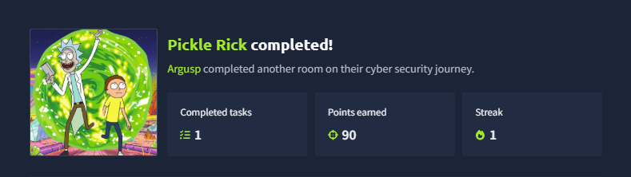

# Room Description:

This Rick and Morty-themed challenge requires you to exploit a web server 
and find three ingredients to help Rick make his potion and transform himself back into a human from a pickle.

Deploy the lab machine on this task and explore the web application: 10.113.184.95

# Basic Enumeration

We began the room by enumerating, we performed an nmap scan to identify the services and ports used by the machine.

 #nmap -sV -p- 10.113.147.255

 Output:

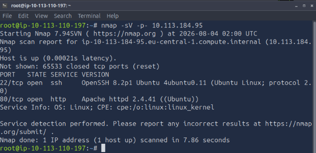

 We identified the services and ports used by the machine, it is running ssh and http services on ports '80' and '443'. Running on versions OpenSSH 8.2p1 and Apache httpd 2.4.21 on Ubuntu.

 # Checking the website

 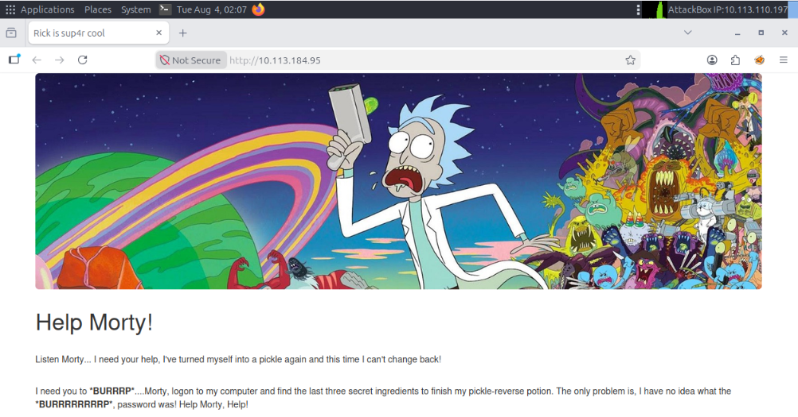

 We opened the website with firefox browser from the CLI.

 #firefox http://10.113.184.95

 This gave us some clues on what to do

 -Find 3 'ingredients'
 -Find the Password

 We began enumerating index.html more, we then discovered Rick's username from the comments,
 
 Username : R1ckRul3s. 

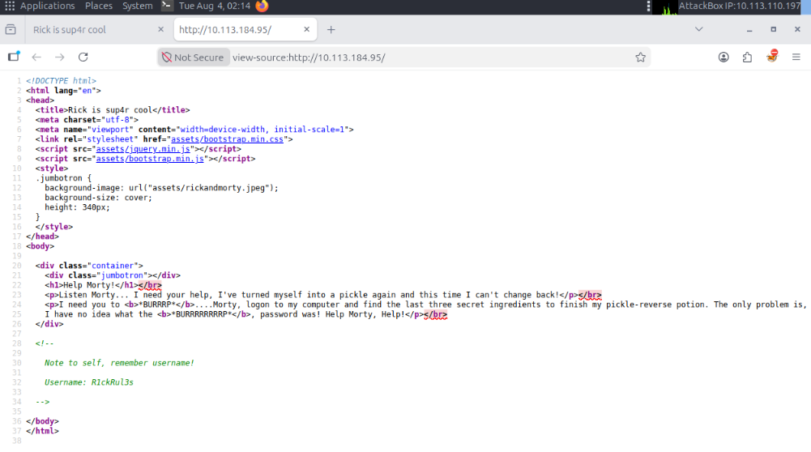

We enumerated the website's hidden directories by using a tool called 'gobuster', and found the following directories:

 #gobuster dir -u http://10.113.184.95 -w /usr/share/wordlists/dirb/common.txt -x php,txt,html

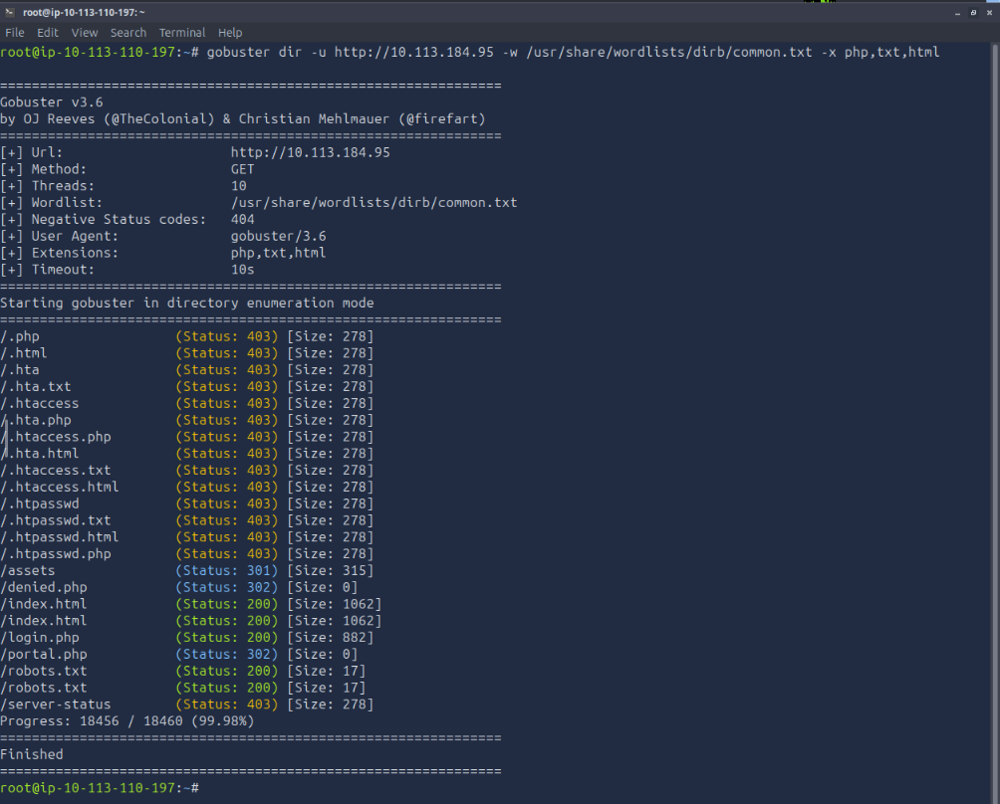

 We opened /robots.txt and found: 'Wubbalubbadubdub', which I assume is the password of Rick?
 Another thing we found interesting is '/login.php', so we navigated there and found a credentials input field.

 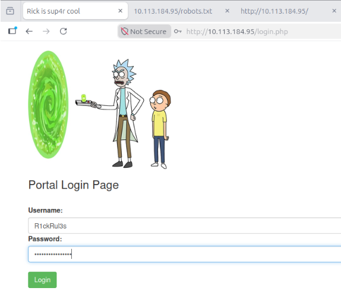

 Username : R1ckRul3s (obtained from index.html's comment field)
 Password : Wubbalubbadubdub (obtained from /robots.txt)

# Initial Access

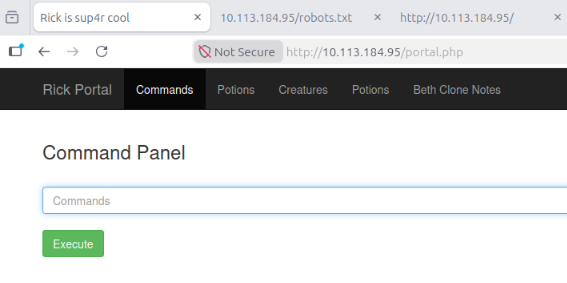

We got inside Rick's computer after exploiting it, and we also got a command line input field, which blocks the 'cat' command, so we used another command instead, which is 'less'.

We then ran the command 'ls -la' to find Rick's directories, we then found 'Sup3rS3cretPickl3Ingred.txt'.

#ls -la 
#less 'Sup3rS3cretPickl3Ingred.txt'

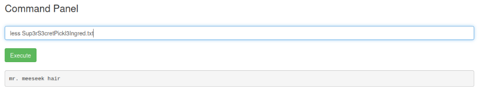

Output: 'mr. meeseek hair' (The first ingredient)

We then enumerated Rick's home directories

#ls -la /home/rick

and found a file called 'second ingredients'

#less "/home/rick/second ingredients"

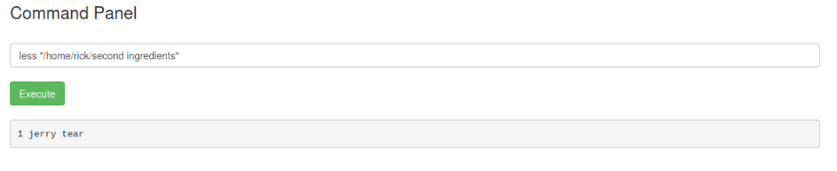

Output: 1 jerry tear (The second ingredient)

we then checked if we can have privileges.

#sudo -l

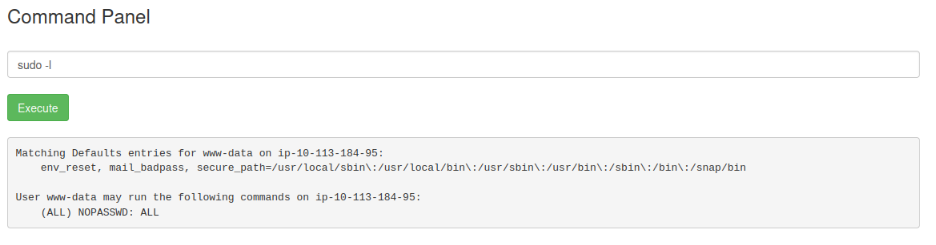

We then Discovered that 'www-data' has full (ALL : ALL) ALL NOPASSWD privileges. We then inspected the /root directory using elevated privileges to retrieve the final ingredient.

We had to see what files existed inside the /root directory. Since normal users can't open '/root', we ran ls with privileges:

#sudo ls -la /root

Output:

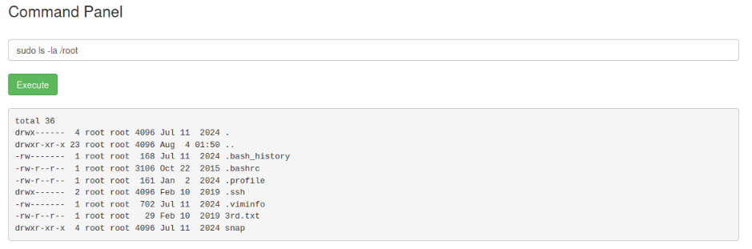

#sudo less /root/3rd.txt

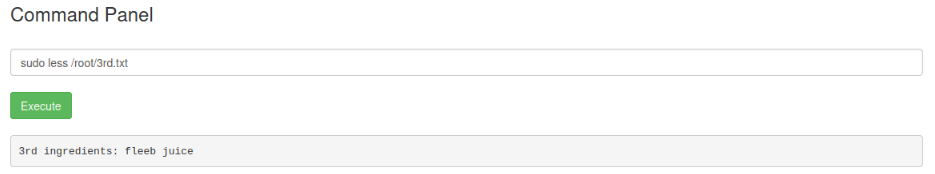

Output: fleeb juice (The third and last ingredient)

# PickleRick Room Finished!